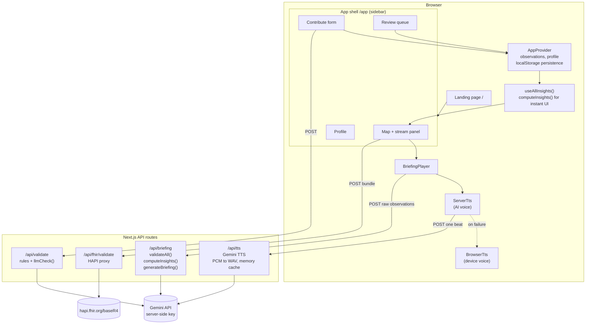
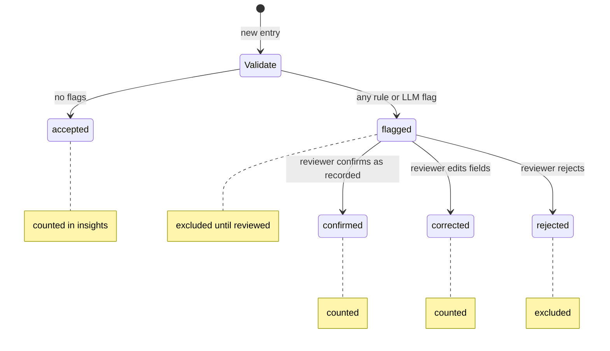
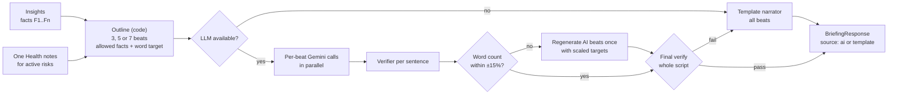
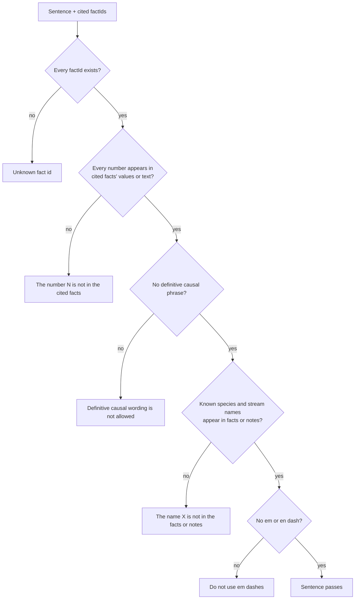
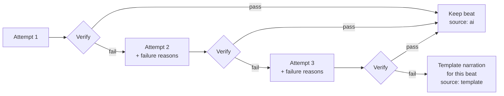
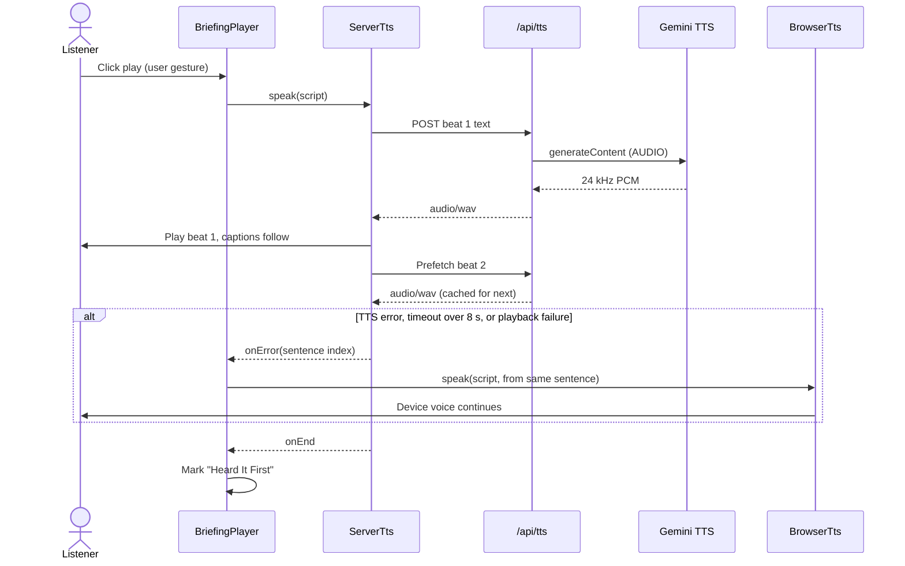
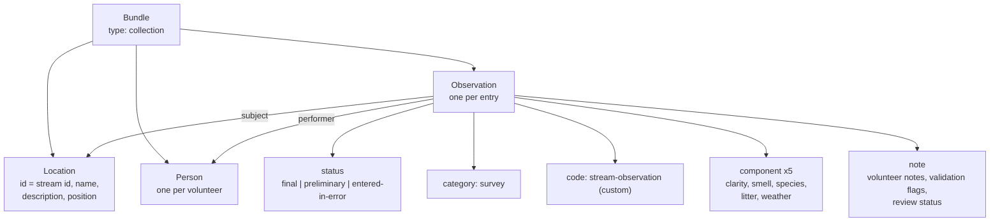

<h1 align="center">StreamVoice Architecture</h1>

<p align="center">
  <em>How observations become a verified, spoken briefing.</em>
</p>

<p align="center">
  <a href="#system-overview">System Overview</a> ·
  <a href="#data-model">Data Model</a> ·
  <a href="#insight-engine">Insight Engine</a> ·
  <a href="#validation-pipeline">Validation</a> ·
  <a href="#narration-pipeline">Narration</a> ·
  <a href="#voice-pipeline">Voice</a> ·
  <a href="#api-reference">API Reference</a> ·
  <a href="#client-state">Client State</a> ·
  <a href="#security-model">Security</a> ·
  <a href="#known-gaps">Known Gaps</a>
</p>

---

## Design Principles

| Principle | What it means in the code |
|:---|:---|
| **Code computes, the LLM narrates** | Every statistic comes from pure functions in `src/lib/insights/`. The LLM receives a finished list of facts and never sees raw observations during narration. |
| **Verify everything the LLM writes** | Each generated sentence passes `verifySentence()` before it can reach a listener. |
| **Always have a deterministic path** | Every AI step has a non-AI fallback: template narration for text, browser speech for audio, rules-only validation for checks. |
| **The server owns the truth** | API routes recompute facts and re-run validation from raw observations. Client-supplied facts are never accepted. |
| **Humans confirm suspicious data** | Flagged entries are excluded from every score and briefing until a reviewer acts. |

---

## System Overview



The insight engine runs in two places on purpose. The browser runs it for instant UI updates (score rings, chips, the map). The server runs it again from raw observations whenever narration is requested, so a tampered client cannot change what the AI is allowed to say.

### Module Map

| Module | Responsibility | Depends on |
|:---|:---|:---|
| `lib/types.ts` | Shared types: `Stream`, `Observation`, `Fact`, `Sentence`, `BriefingResponse` | none |
| `lib/insights/` | Periods, score, trend, risk flags, confidence, facts builder | types |
| `lib/validation/` | Rule checks, LLM second opinion, pipeline | insights, llm |
| `lib/narration/` | Outline, prompts, per-beat sections, verifier, fallback, orchestration | insights, llm, store/seed |
| `lib/llm/` | Provider adapter: JSON-mode generation, retries, Zod parsing | `@google/genai` |
| `lib/tts/` | `TtsProvider` interface, server and browser providers, WAV encoder | types |
| `lib/fhir/` | FHIR R4 resource mapping and bundle assembly | types |
| `lib/gamification/` | Week streaks and badges | insights |
| `lib/store/` | Seed loading, `AppProvider` context, localStorage persistence | validation |
| `lib/ui.ts` | Health bands, colors, `useAllInsights()` hook | insights, store |

---

## Data Model

Defined in [`src/lib/types.ts`](src/lib/types.ts).

### Observation

| Field | Type | Notes |
|:---|:---|:---|
| `id` | `string` | `obs-01` for seed data, `obs-<base36 time>` for new entries |
| `streamId` | `string` | Matches `Stream.id` |
| `observerId` | `string` | Volunteer ID; `me` for the local user |
| `observedAt` | ISO date | Only the date part is used for periods |
| `clarity` | `1..5` | 1 very murky, 5 very clear |
| `smell` | enum | `none`, `earthy`, `sewage`, `chemical`, `other` |
| `species` | `string[]` | Simple labels such as `mayfly nymph`, `heron` |
| `litter` | `0..3` | 0 none, 3 heavy |
| `weather` | enum | `dry`, `light_rain`, `heavy_rain`, `unknown` |
| `notes` | `string?` | Trimmed to 500 characters on submit |
| `status` | enum | `accepted`, `flagged`, `confirmed`, `corrected`, `rejected` |
| `flags` | `ValidationFlag[]` | `{ code, message, source: "rule" \| "llm" }` |

### Status Lifecycle



### Fact

The only content the narration layer may use.

| Field | Example |
|:---|:---|
| `id` | `F3` |
| `kind` | `count`, `period`, `score`, `trend`, `risk` |
| `text` | `"The health score is 49 out of 100. Last period it was 92."` |
| `values` | `{ score: 49, previousScore: 92 }` |
| `sourceObservationIds` | `["obs-01", "obs-02", ...]` |

---

## Insight Engine

Location: `src/lib/insights/`. All functions are pure and deterministic.

### Periods

| Period | Range |
|:---|:---|
| Current | The 30 days ending at `ANCHOR_DATE` (2026-09-30), inclusive |
| Previous | The 30 days before that |

A fixed anchor keeps the demo stable regardless of the current date. Only observations with status `accepted`, `confirmed`, or `corrected` are counted.

### Health Score (`score.ts`)

```
clarity  = (mean clarity − 1) / 4 × 100
species  = min(distinct species, 6) / 6 × 100
litter   = (1 − mean litter / 3) × 100
smell    = mean of { none, earthy: 100 · other: 50 · sewage, chemical: 0 }

score    = round(0.40 × clarity + 0.30 × species + 0.15 × litter + 0.15 × smell)
score    = null when fewer than 2 counted observations
```

Species are compared case-insensitively after trimming.

### Trend (`trends.ts`)

| Condition | Trend |
|:---|:---|
| Either score is `null` | `unknown` |
| Delta ≥ +8 | `improving` |
| Delta ≤ −8 | `declining` |
| Otherwise | `stable` |

### Risk Flags (`flags.ts`)

| Code | Rule | Source observations |
|:---|:---|:---|
| `RUNOFF_SIGNAL` | Mean clarity falls by ≥ 1 **and** distinct species fall by ≥ 20%. Marked `strengthened` if a heavy rain day occurred. | Both periods |
| `LITTER_RISING` | Mean litter rises by ≥ 0.75 | Both periods |
| `ODOR_REPORTED` | Any sewage or chemical smell in the current period | The smelly entries |
| `LOW_BIODIVERSITY` | ≤ 2 distinct species in the current period | Current period |
| `LOW_DATA` | < 3 counted observations in the current period | Current period |

### Confidence (`confidence.ts`)

| Label | Condition (checked in order) |
|:---|:---|
| Low | Fewer than 3 counted observations, or any unresolved flagged entry in the period |
| High | 6 or more counted observations from 2 or more volunteers |
| Medium | Everything else |

### Facts Builder (`facts.ts`)

`computeInsights(stream, observations)` returns metrics for both periods plus an ordered fact list with sequential IDs:

| Order | Fact | Present when |
|:---|:---|:---|
| 1 | Observation and volunteer count | Always |
| 2 | Current and previous period dates | Always |
| 3 | Health score (and previous score) | Current score is not `null` |
| 4 | Trend and point change | Trend is not `unknown` |
| 5 to 7 | Clarity, species, litter changes | Both periods have data and the value changed |
| 8+ | One fact per active risk flag | Per flag |
| Last | Confidence, reviewed count, pending count | Always |

---

## Validation Pipeline

Location: `src/lib/validation/`.

### Rule Checks (`rules.ts`)

| Code | Fires when |
|:---|:---|
| `FISH_BUT_HEAVY_POLLUTION` | Species include fish or minnow, or 4 or more species, **and** clarity is 1 **and** smell is sewage or chemical |
| `CLEAR_BUT_ALGAE_NOTE` | Clarity ≥ 4 and notes mention scum, algae, bloom, or foam |
| `NO_LITTER_BUT_TRASH_NOTE` | Litter is 0 and notes mention trash, bags, bottles, or dumping |
| `OUTLIER_VS_STREAM` | At least 3 counted entries in the prior 30 days, and clarity differs from their median by ≥ 3 |
| `RAIN_CLARITY_MISMATCH` | Heavy rain with clarity 5 |

Each flag carries a plain-language message shown to the volunteer and the reviewer.

### Entry Points (`pipeline.ts`)

| Function | Used by | Behavior |
|:---|:---|:---|
| `validateObservation(o, history)` | Internal | Rules only. Any flag sets `flagged`, otherwise `accepted`. |
| `validateAll(list)` | Seed load, `/api/briefing` | Sorts by date and validates each entry against earlier counted entries of the same stream. Entries already `confirmed`, `corrected`, or `rejected` keep their reviewer decision. |
| `validateNew(o, history)` | `/api/validate` | Rules plus `llmCheck()`. An LLM flag also sets `flagged`. |

### LLM Second Opinion (`llmCheck.ts`)

Sends the observation fields and notes to Gemini at temperature 0.2 and expects `{ suspicious: boolean, reason: string }`. It only looks for internal contradictions. If the key is missing or the call fails, it returns no flag and the rules result stands.

---

## Narration Pipeline

Location: `src/lib/narration/`. Entry point: `generateBriefing(insights, level, minutes)`.



### 1. Outline (`outline.ts`)

The outline is built by code, not by the LLM. That keeps the "only cite these facts" contract simple and testable.

| Length | Beats | Plan |
|:---|:---|:---|
| 1 min | 3 | open + score · metrics + signal · why it matters + confidence |
| 2 min | 5 | open · score + metrics · signal · why it matters · confidence |
| 3 min | 7 | open · score · metrics · signal · people and pets · wildlife and environment · confidence |

Each beat gets the fact IDs it may cite, the One Health note categories it may use, and a word target of `minutes × 150 / beats`.

### 2. Per-Beat Generation (`sections.ts`, `prompts.ts`)

All beats are generated in parallel. Each call:

| Setting | Value |
|:---|:---|
| Model | `LLM_MODEL` (default `gemini-2.5-flash`) |
| Mode | `responseMimeType: application/json` with a JSON schema generated from Zod |
| Temperature | 0.3 |
| Thinking budget | 0 |
| Output | `{ sentences: [{ text, factIds }] }`, 1 to 6 sentences |

The system prompt sets the rules: use only provided facts and notes, hedged causality only, cite fact IDs on every sentence, no em dashes. The user prompt adds the listener style, the beat topic, the word target, the allowed facts, and the allowed notes.

### 3. Verifier (`verify.ts`)



All checks run on every sentence and failures are collected, so a single retry prompt can list every problem at once.

### 4. Retry and Fallback



The LLM adapter (`llm/client.ts`) separately retries each call once after 800 ms on 429, 5xx, or network errors. If the LLM is unavailable (no key), all beats go straight to the template.

### 5. Length Control

After assembly, if the total word count is outside ±15% of `minutes × 150`, each AI-written beat is regenerated once with a scaled word target. Template beats are kept as they are.

### 6. Final Check

The whole script is verified once more. If anything fails, the entire briefing switches to the template narration. The response `source` is `ai` only when every beat was AI-written.

### Template Narrator (`fallback.ts`)

Builds sentences directly from fact values and the curated notes, at all three listener levels, using the same beat structure. Its output passes the verifier at every level and length; this is covered by tests.

### One Health Notes (`onehealth.ts`)

`data/one-health-notes.json` holds a note for each risk code across four categories (people, pets, wildlife, environment) at three reading levels. Active risk codes select which notes the narration and the UI cards may use.

---

## Voice Pipeline

Location: `src/lib/tts/`, `src/app/api/tts/route.ts`, `src/components/BriefingPlayer.tsx`.

### Provider Interface

```ts
interface TtsProvider {
  readonly label: "AI voice" | "Device voice";
  speak(sentences, { onSentenceStart, onEnd, onError }, startIndex?): void;
  pause(): void;
  resume(): void;
  stop(): void;
  setRate(rate: number): void;
  progress(): number;
}
```

### Server Voice (`ServerTts`)

1. Groups sentences by beat; each beat becomes one clip (3 to 7 TTS calls per briefing).
2. Fetches the first clip, starts playback, and prefetches the next clip while the current one plays.
3. Highlights captions by splitting the real clip duration in proportion to each sentence's character count.
4. Skipping within a clip seeks to the proportional offset.

### Playback Sequence



### TTS Route

| Step | Detail |
|:---|:---|
| Input | `{ text, level }`, text up to 4000 characters |
| Style prompt | child: warm and gentle · adult: calm and clear · scientist: neutral and precise |
| Model and voice | `TTS_MODEL`, `TTS_VOICE` |
| Output conversion | Gemini returns 24 kHz, 16-bit, mono PCM; the route adds a 44-byte WAV header |
| Cache | In-memory map keyed by SHA-256 of text, voice, and style |
| Unavailable | `503` when `TTS_PROVIDER=browser` or no key; `502` on upstream failure |

### Fallback to Device Voice

| Trigger | Result |
|:---|:---|
| TTS request fails or returns non-200 | Resume from the same sentence with `BrowserTts` |
| Request takes longer than 8 seconds | Same |
| Audio element fails to play | Same |
| Any of the above once | `sessionStorage` marks the AI voice as down for the session, so later plays start with the device voice. **Regenerate** clears this. |

`BrowserTts` queues one `SpeechSynthesisUtterance` per sentence, prefers a natural-sounding English voice, and fires `onSentenceStart` for exact caption sync.

### Autoplay Policy

Audio is only created and started inside the play button's click handler (or the space key handler). Nothing plays on page load.

---

## API Reference

### `POST /api/briefing`

```jsonc
// Request
{
  "streamId": "berrys-creek",
  "observations": [ /* Observation[], max 2000 */ ],
  "level": "child" | "adult" | "scientist",
  "minutes": 1 | 2 | 3
}

// Response 200
{
  "script":     [{ "text": "...", "factIds": ["F3"], "beat": 1 }],
  "facts":      [ /* Fact[] recomputed on the server */ ],
  "wordCount":  183,
  "source":     "ai" | "template",
  "confidence": "High" | "Medium" | "Low",
  "oneHealth":  [{ "code": "RUNOFF_SIGNAL", "label": "...", "people": "...", "pets": "...", "wildlife": "...", "environment": "..." }]
}
```

| Status | Meaning |
|:---|:---|
| 400 | Request failed Zod validation |
| 404 | Unknown `streamId` |

### `POST /api/validate`

```jsonc
// Request
{ "observation": { /* Observation */ }, "history": [ /* same-stream Observation[] */ ] }

// Response 200: the observation with updated status and flags
```

### `POST /api/tts`

```jsonc
// Request
{ "text": "One beat of the script.", "level": "adult" }

// Response 200: audio/wav
```

### `POST /api/fhir/validate`

Request body is a FHIR Bundle. Forwards it to `https://hapi.fhir.org/baseR4/Bundle/$validate` with a 10 second timeout and returns `{ ok, outcome }`, or `502` with a friendly message if the server is unreachable.

---

## Client State

All state lives in the browser. There is no database.

| Key | Storage | Contents |
|:---|:---|:---|
| `streamvoice.observations.v2` | localStorage | All observations including reviewer decisions and new submissions |
| `streamvoice.profile.v1` | localStorage | Display name, local ID, role, whether a full briefing was heard |
| `streamvoice.briefing.v1.<hash>` | localStorage | Cached briefing per (facts, level, length) |
| `streamvoice.sidebar.collapsed` | localStorage | Sidebar preference |
| `sv.ttsDown` | sessionStorage | Set when the AI voice failed this session |

Every read and write is wrapped in `try/catch`, so the app still works when storage is blocked. The briefing cache key is a hash of the facts, so any data change (a new observation, a reviewer decision) produces a new key and a fresh briefing.

**Reset sample data** in the review queue restores the seed observations.

---

## FHIR Mapping

Location: `src/lib/fhir/`.



Custom code system: `https://streamvoice.example/fhir/CodeSystem/stream-observation`.

---

## Security Model

| Concern | Mitigation |
|:---|:---|
| **API key exposure** | `GEMINI_API_KEY` is only read in server code. The browser talks to `/api/*` routes. |
| **Client tampering with facts** | `/api/briefing` accepts raw observations only, re-runs `validateAll()`, and recomputes facts. |
| **Smuggling flagged entries into scores** | Server-side re-validation flags them again unless a reviewer decision is present. |
| **Oversized requests** | Briefing requests are Zod-validated with a 2000 observation cap; TTS text is capped at 4000 characters; notes at 500. |
| **Public map key** | `NEXT_PUBLIC_CARTO_KEY` is a tile key intended for browser use. |

Because reviewer decisions are stored client-side, a determined user can mark their own entries as confirmed. A shared backend with authenticated reviewers is needed before real-world use.

---

## Testing

```bash
npm test
```

| Layer | Test file | Key assertions |
|:---|:---|:---|
| Insight engine | `tests/insights.test.ts` | Declining, stable, and improving sample streams; null scores; confidence tiers; sequential fact IDs |
| Validation | `tests/validation.test.ts` | Exactly the 3 planted entries flagged; 21 clean entries pass; flagged entries excluded from insights |
| Narration | `tests/verify.test.ts` | Verifier rejects invented numbers, unknown IDs, causal claims, unknown species; template narration passes at all 9 combinations |
| FHIR and streaks | `tests/fhir.test.ts` | Status mapping, required fields, bundle composition, consecutive week counting |

CI (`.github/workflows/ci.yml`) runs `npm ci`, `npm test`, and `npm run build` on every push and pull request.

---

## Known Gaps

| Gap | Impact | Planned fix |
|:---|:---|:---|
| No pre-generated briefings or audio | First play of each beat waits on live Gemini calls | Generate and commit audio for the sample streams in `public/audio/`; `ServerTts` already accepts a pre-generated prefix |
| Length control is loose | 1-minute AI briefings can exceed the ±15% budget | Enforce per-beat word caps in the schema and trim deterministically |
| Repeated points across beats | Parallel beats can restate the same signal | Pass earlier beat summaries into later prompts, or dedupe similar sentences |
| Server caches are per instance | TTS cache resets on each serverless cold start | Move to a shared cache or object storage |
| No rate limiting | Public deployments can exhaust the Gemini quota | Add a per-IP limiter to `/api/briefing` and `/api/tts` |
| `/api/validate` body is not schema-checked | Malformed input could reach the LLM check | Add a Zod schema matching `Observation` |
